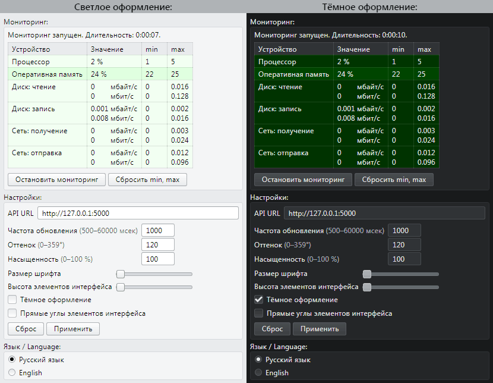

# Содержание

- [Даты изменения](#Даты-изменения)
- [Тип репозитория](#Тип-репозитория)
- [Информация о проекте](#Информация-о-проекте)
  - [Основная информация](#Основная-информация)
  - [Применённые технологии](#Применённые-технологии)
- [Скриншоты](#Скриншоты)
  - [Светлое и тёмное оформление](#Светлое-и-тёмное-оформление)
  - [Настройки внешнего вида](#Настройки-внешнего-вида)

---

# Даты изменения

[⬆](#Содержание)

| Действие                           | Дата                |
|------------------------------------|--------------------:|
| Информация о проекте была изменена | 27.09.2022          |
| Скриншоты были сделаны             | 27.09.2022          |
| Работа над проектом началась       | примерно 09.06.2022 |

---

# Тип репозитория

[⬆](#Содержание)

Это не проект с открытым исходным кодом. Это портфолио в виде информации о проекте (со скриншотами результата работы над проектом).

---

# Информация о проекте

## Основная информация

[⬆](#Содержание)

Это web-приложение для мониторинга загруженности компьютерных комплектующих (список комплектующих приведён на скриншотах).

---

## Применённые технологии

[⬆](#Содержание)

- FrontEnd
  - HTML (своя вёрстка)
  - CSS (свои стили)
  - JavaScript (без фреймворков)
- BackEnd
  - Python
    - фреймворк "Flask"
    - фреймворк "Flask-RESTful"
    - библиотека "psutil"

Рендеринг HTML-страницы происходит на стороне клиента (FrontEnd) в JavaScript.

JavaScript через fetch делает запрос на BackEnd к REST API. Ответ приходит в виде JSON-данных.

---

# Скриншоты

## Светлое и тёмное оформление

[⬆](#Содержание)

В ответе единицы измерения количества информации представлены в байтах. Для этих значений расчёт скорости выполняется на стороне клиента (FrontEnd) в JavaScript. Высчитывается разница между текущим и предыдущим ответом, делится на частоту опроса и переводится в мегабайты (и мегабиты).

---

## Настройки внешнего вида

[⬆](#Содержание)

В этом проекте к элементам интерфейса можно применить следующие настройки:
- Светлое\тёмное оформление.
- Скруглённые\острые углы элементов.
- Размер шрифта.
- Высота элементов (чем больше, тем удобнее для сенсорных экранов).

Результат применения настроек внешнего вида представлен в другом моём репозитории (этого же профиля), у которого описание "Элементы интерфейса, которые я использую для оформления web-страниц своих проектов".

---

[⬆](#Содержание)
